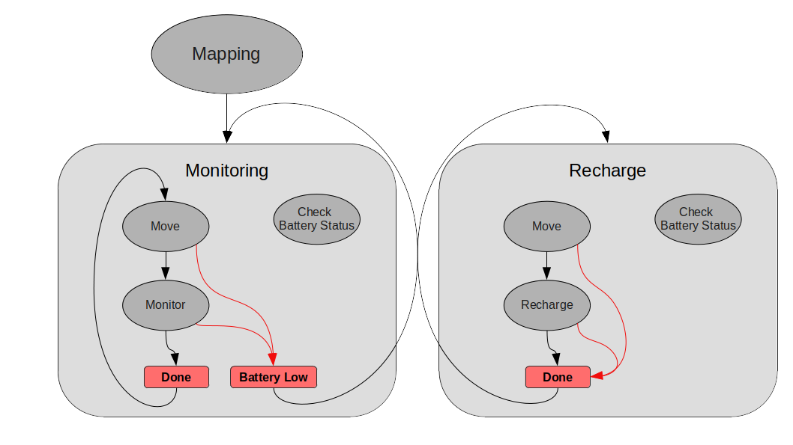
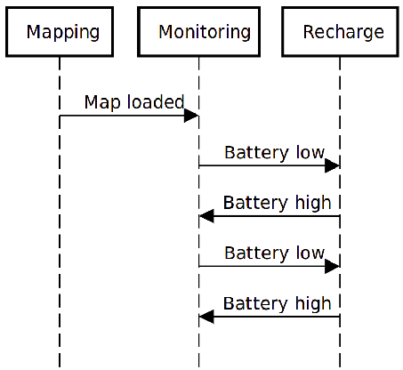

# ExpRobLab_Assignment

**A ROS-based exercise for the Experimental Robotics Laboratory course held at the University of Genoa.**  
Author: *Samuele Depalo*  
[Code documentation](https://samueled98.github.io/assignment_1/)

---
> :memo: **Assignment 2:** 
> 
> In this second assignment of the Experimental Robotics Laboratory course, the architecture developed in the first assignment is integrated with a robotic simulation. 
> 
> The following ReadMe and the documentation have been integrated with all the difference from the original system

## Introduction

This repository contains ROS-based software for controlling a robot. 
The main components are
- a state-machine that represent the robot behaviour according to the environment and to some stimulus
- ???

### Scenario

The considered mobile robot retrieves environment related information from some aruco markers (7!!!) next to it when spawned. This data are used for  moving across locations.
Here how the robot should behave:
1. The robot should scan the markers and load a map before any other action
2. The robot should move between corridors
3. If a room is not visited for a given time, the robot should visit it
4. If the robot's battery is low on energy, the robot should stop the current action and go in the first room for recharging.  

### Assumptions
- The map is built as an ontology stored in a .owl file
- The maps follow the same scheme as the one given for the assignment (i.e. same ontology, different ABox)
- The robot starts its motion with enough energy to load the map (so a *battery low* stimulus is ignored in that state)
- May happens the battery results full after a *battery low* signal comes. Why this, it's not part of the discusion (could be a battery level misreading,  poor/defective hardware,.. ).

### Package List  UPDATEEEEEEEEEEEEEEEEEEEEEEEEEEEEE !!!!!!!!!!!!!!!!!!!!!!!!!!!!!!!!!

The repository contains the following resources:
- action --> actions' structure
  - OICommand.action: It defines the goal and results concerning the ontology interface
  - Scanner.action: It defines the goal and result concerning the map scanning/loading
  - Plan.action: It defines the goal and results concerning motion planning
  - Control.action: It defines the goal and results concerning motion controlling
- launcher --> ROS launchers
  - armor.launch: just run the armor server
  - system.launch: main launcher, use this
  - debug.launch: as the main one but the parameters are set for testing the system limits
- msg --> messages' structure
  - Point.msg: It is the message representing a 2D point
- ontology --> .owl files
  - map1.owl: ontology as described in the assignment
- scripts --> python scripts for the ROS nodes (described below)
  - state_machine.py
  - robot_state.py
  - ontology_interface.py
  - scanner.py
  - planner.py
  - controller.py
- srv --> services' structure
  - GetPose.srv: It defines the request and response to get the current robot position
  - SetPose.srv: It defines the request and response to set the current robot position
- images --> images shown in this ReadMe

There are also files related to the ROS architecture (*CMakeLists.txt* and *package.xml*) and to the code documentation (*Makefile*, *conf.py* and *index.rst*).

## Software architecture

### The state machine  

Here a representation of the implemented state machine:  

<!--   

In order to simplify the diagram, the connection among states don't show the stimulus name but, instead, it's possible to distinguish by the color the normal flow of the machine (black arrows) from the stimulus due to a change in the battery status (red arrows).  
-->

The desired behaviour can be easily implemented using three (main) states:
1. A **Mapping** state: here the information about the environment (.owl file) is loaded to be avaiable at need.
2. A **Monitoring** state: the robot is expected to move across rooms and observe, *monitor*, the environment (although in this work the monitoring task consist of busy waiting).
3. A **Recharging** state: once the system is notified the battery is low, the robot should move to a specific location for recharging  

This state machine has the particularity of being hierarchical: both the Monitoring and the Recharging state consist of an inner state and an inner state machine (EXECUTE) with other two states. Also, while the system can be in just one state in the outer state machine, this is not valid for the inner ones: the main states are concurrent state machines.

Here a description of the inner state machine EXECUTE:
1. **Move** state: it retrieves the next target location for the robot and interacts with the planner, and then the controller, in order to reach that location.
2. **Monitor**/**Recharge** state: in this implementation these states actually consist in busy waiting for a given time, simulating the actual task the robot should carry in that time (either exploring the environment or recharging itself).  

The last inner state is the **Check Battery status** state: this is a [Monitor state](http://wiki.ros.org/smach/Tutorials/MonitorState), a particular kind of states that *Smach* allows to use. It works in [concurrence](http://wiki.ros.org/smach/Tutorials/Concurrent%20States) with the EXECUTE state machine, waiting for a message to be published on a specific topic: '/battery_status'. Once something is published a callback is called to decide if due to this change in the battery level, the current state machine should be preempted for the other main state.  

**Why not having a main MOVE state?**  
The motion between locations could be considered a single main state. This state, though, should have a different behaviour depending on the situation (monitoring/recharging) in both choosing the next location and in terms of being preempted when a stimulus arrives (if the robot is already going to the recharging room and a *battery low* signal arrives, the robot shouldn't stop the motion for that room a start it from the beginning). So, implementing two different **move** states reduce consistently the complexity of the execution and, more, increase the modularity (what if I want one of the monitor states to monitor a topic and the other state a different one?). The code is however simple: they are created from the same class ( *Move* ) but with a slightly different configuration (more of this later).  

**Why concurrent?**  
While the system can be in just one state in the outer state machine, this is not valid for the inner ones. In fact the *Check Battery status* is always active during the execution of the monitoring/recharging phase.  
Alternatively, the syncronization among subsribers and action servers should require mutexes and a much complex software.  
By exploiting the full potential of *Smach* with this concurrent structure, the transitions among states are guaranteed to be executed as soon as a stimulus arrives. It is also modular: the same *Check Battery status* state can process any message published on the given topic and so distinguish different kind of stimulus. This Smach's Monitor states are not computationally expensive and so they don't delay the concurrent state's execution of a considerable time.

**Why hierarchical?**  
Choosing of separating the motion of the robot from the main task of the two states (Monitoring and Recharge) increases the modularity: in fact, doing so, allow to change one of the two tasks by just modyfing the inner state and leaving as it is the other. Even more, by adding another inner state you can easily increase the tasks of the robot.

**Temporal diagram**  
Here how the state machine evolves over time:  
  
Normally the robot should keep moving from location to location.  
When a *battery low* signal is received, the **Monitoring** state is preempted and the execution goes to the **Recharging** state. From there, either the robot goes in the recharging room a wait for itself to be fully recharged or, could happen, a new signal comes (*battery high*) before it could even reach the room. In that case it's the **Recharging** state to be preempted for the Monitoring one: there's no point in going to recharge if the robot has still power.

### Software components

It follows the details of each software component implemented in this repository, which is available in the *scripts/* folder.

#### The State Machine node  
It implements the robot's behaviour.
Four different kind of state's implementation are described in as many classes: *Mapping()*, *Move()*, *Monitor()* and *Recharge()*.    
The execute of a Mapping() state simply send a goal to the Scanner node for loading the map and waits for it to end.  
Move(), depending on the "type" argument, either asks to the Ontology Interface node for the next room to visit or it asks for the recharging room.  
After, it sends a goal to the planner, first, and then to the controller for planning and control the motion to the target. Finally, it asks the Ontology Interface to update the robot position in the ontology.   
Mind that the *wait_for_result()* instructions placed after the while loops are there just to syncronize the code with the action result. If it weren't for those, as soon as the *get_result()* instruction was called, an error would raise because the result is not available yet.  
In Recharge() there's only a busy waiting, to simulate the time the robot should spend performing that action.
The main code consist in setting the node, configuring the state machine as already described, starting the server for visualization, initializing the action clients, waiting for the actions servers and finally executing the state machine.  
Important to mention four callbacks:
- **monitor_cb()** is called when a new message is published in /battery_status and terminates its execution only if the new battery status is different from the old one. This in order to ignore consecutive messages with the same information (if the robot already knows the battery is low and it's going to recharge, it should not interrupt this action if a new *battery low* message arrives)
- **child_term_cb()** is called when any of the concurrence states terminates and simply terminates all the other states. This because, having a monitor state (which terminate its execution when the battery status changes) in concurrence with the monitoring/recharging states, the desired behavior consist in preempting one of these states when the other terminates (i.e. the battery status goes to low --> the check_battery_status state terminates its execution --> preempt the monitoring states for recharging, or, viceversa, the battery status goes to high --> the check_battery_status state terminates its execution --> preempt the recharging states for monitoring).
- **out_cb_monitoring()** is called when all the concurrent states are terminated and decides which outcome the concurrence state machine, in the monitoring state, should return. If the inner *EXECUTE* state machine has been preempted from the *Check Battery status* then the outcome is *battery_low*, else the outcome is *monitoring_done*.
- **out_cb_recharge()** is similar to the precedent. In this case, though, it always returns *recharge_done* because either the robot terminate the recharging execution or the state is preempted because a *battery high* update is received.

Actions:  
- *OntologyInterface*, client
- *action_scanner*, client
- *action_planner*, client
- *action_controller*, client

#### The Ontology Interface node  

This node provides an interface for all the other components to the [armor](https://github.com/EmaroLab/armor) server, allowing them to query and manipulate an ontology in a easier and modular way. By doing so, the other components (e.g. planner, controller) have no commands related to the armor server connection.  
The node presents a [SimpleActionServer](http://wiki.ros.org/actionlib_tutorials/Tutorials/SimpleActionServer%28ExecuteCallbackMethod%29) which possible goals are:
- *load_map*: load the ontology specified in the rosparams server, updates it with informations retrieved from the Aruco markers, save lists of names of the main locations and also the name of the robot, update the urgency threshold with the one given as parameter, call the reasoner and update the robot's *now* timestamp.
- *next_room*: find the next location the robot should visit following a predetermined algorithm. It retrieves the urgent rooms as the elements that are both in the urgent locations list and in the rooms list, then takes one of those which are also reachables. If there are none, it choose a reachable corridor. If no corridors nor urgent rooms are avaiable, it takes randomly a reachable location. It returns the name of the location along with its coordinates.
- *move_to*: once the robot reaches a new location, the node update both its position in the ontology and the *visitedAt* value for the new location.
- *recharge_room*: return the location for the recharging of the robot.  

The functions pretty much corresponds to the actions the server is able to carry out. There are two more functions which are often called during the computation:
- *update_timestamp*: like already mentioned it updates the *now* timestamp of the robot and calls the reasoner.
- *clean_response_list*: the responses returned by the armor queries have to be processed before using them. Firstly the function retrieves a list from the response and then removes the *IRI* plus some special character from each element. When it's dealing with a timestamp, it removes also the string '^^xsd:long'.  

Mind that all the calls to the armor server are made with the [armor_py_api](https://github.com/EmaroLab/armor_py_api) and following [these](https://github.com/EmaroLab/armor/blob/master/commands.md) tips. Please refer to those page for tutorials and documentation.

Services:
- /armor_interface_srv (waits for it to be ready)

Actions:
- OICommandAction, server

#### The Robot State node  UPDATE IT !!!!!!!!!!!!!!!!!!!!!!!!!!!!!!!!!!!!!!!!!!!!!!!!!!!
Similar to the one implemented in [arch_skeleton](https://github.com/buoncubi/arch_skeleton), this node implements two services (set_pose and get_pose) and a publisher (battery_status).

The services allow setting and getting the current robot position, which is shared between the planner and the controller.

The battery_status message is published when the batter changes state. We consider two possible states: low battery (True is published) and recharged (False is published).
The battery_time parameter is used to delay the published messages.

Messages:
- battery_status, publisher

Services:
- GetPose, server
- SetPose, server

#### The Scanner node     UPDATEEEEEEEEEEEEEEEEEEEEEEEEEEEEEEE !!!!!!!!!!!!!!!!!!!!!!!!!!!!!!!!!!!!!!!!!!!!!!!!
This node controls the camera arm in order to scan the enviroment for the Aruco markers at first, and then scan the locations once the robot reaches them.
As an action server, if it receives the 'load map' command, it will scan the environment until it has saved the ids of 7 different markers. The node subscribes to the topic '/marker_publisher_mod/id' where the scanned ids are posted. The callback checks not only if the id is already saved in the list, but checks also for the validity of the scanned id by calling the service 'room_info'. In order to load the map, the camera will move in two different configurations untile all the ids are scanned, then those are sent to the ontology interface node to actually load the map.

Actions:
- ScannerAction, server
- OICommandAction, client

## Launching the Software

### Dependencies

In order to install and run this application, first you should install the *aRMOR* and the *SMACH* package (you can follow the procedure described [here](https://unigeit.sharepoint.com/sites/106723-ExperimentalRoboticsLaboratory/Class%20Materials/Forms/AllItems.aspx?id=%2Fsites%2F106723%2DExperimentalRoboticsLaboratory%2FClass%20Materials%2FROS%2Dinstallation%2Emd&parent=%2Fsites%2F106723%2DExperimentalRoboticsLaboratory%2FClass%20Materials)). Mind that the software also exploits [roslaunch](http://wiki.ros.org/roslaunch), [rospy](http://wiki.ros.org/rospy) and [actionlib](http://wiki.ros.org/actionlib/DetailedDescription).

### Installation

Follow these steps to install:
- Clone this repository inside your ROS workspace (which should be sourced in your .bashrc)
- Run chmod +x <file_name> for each file inside the scripts folder.
- Run catkin_make from the root of your ROS workspace.

### Launchers

For running the software call the launcher with `roslaunch assignment_1 system.launch`.  
This will set the parameters in the server, run the aRMOR server, the state machine and all the other necessary components later described.  
The showed outputs are the state machine node's and the smach viewer's ones. Those are enough to show the robot behaviour

For further information you can call the `roslaunch assignment_1 debug.launch` which shows to screen all the components' output.

### ROS Parameters  
This software requires the following ROS parameters:
- `O_path`: Path for the desired environment ontology
- `O_IRI`: IRI for the desired environment ontology
- `armor_client_id`, default "client"
- `armor_reference_name`, default "ref"
- `ontology_reasoner`, default "PELLET"
- `urgency_threshold`, time after last visit which makes the location urgent, default 7
- `charging_station_in`, recharging room, default "E"
- `scanning_time`, time before loading the map, default 5
- `planning_time`, time for planning a via point, default between 0.1 and 0.2
- `motion_time`, time for reaching a via point, default between 0.1 and 0.2
- `monitoring_time`, busy waiting duration, default 10
- `recharging_time`, busy waiting duration, default 10
- `battery_time`, battery status toggle time, default between 15 and 40

## Code execution  
At runtime the following are some possible outputs.  
Firstly, the robot loads the map:  

The monitoring can start:  
  
The robot decides to go in "R1". Upon reaching the location, the MOVE_TO_MONITOR inner state returns done and pass the execution to the MONITOR state, the one that simulate the monitoring of the environment. Once it ends, the inner state returns "done", making the whole MONITORING state machine return "monitoring_done" and so making the system re-run this last state in order to reach and monitor a new location.   

  
Now the robot goes in "C1" and, while moving, the battery run out of energy. The inner state MOVE_TO_MONITOR is preempted and so it is the MONITORIN state machine. The new state is RECHARGING.  

  
The robot goes in "E" and recharge itself. Once it's done, it returns the "recharge_done" stimulus which gives again the execution to the MONITORING state.  

  
Now, the robot, which has completed a full recharge, continues monitoring the locations. During the monitoring of "R4" it receives an update on the battery status: it is high. The robot already new that and so it ignore the stimulus and keeps monitoring.

## Working hypothesis and environment
### System's features
- Independent from the ontology constitution: the system do not assume the names of the locations nor the robot one. After loading an ontology it just retrieves the necessary elements' names. This allow also to give the recharging room as parameter.
- Highly parametrized: many aspect of the given scenario can be customized (giving any ABox for the used ontology, changing the execution times, recharging rooms,.. )
- The scanner node is ready to implement the means for scanning the data (e.g. a qr code) representing the environment
- The recharge state can be preempted if the battery is high
- Modular: it's easy to change the robot behaviour in every aspect. From the motion task to the monitoring of the environment, from how it retrieves the maps to how it plans and controls the motion.
- Able to withstand a high rate of stimulus

### System's limitations
- The code highly depends on the scenario: it refers to robots, rooms and locations. Re-using this code for a similar application would require re-naming most of the system's elements.
- The simulated battery is pretty far from a realistic one. It should decrease accordingly to the motion made.
- Since the rooms are chosen randomly among the eligibles, could happen that an urgent room is not visited for a relatively long time
### Possible technical improvements
- For now, actions do not return any feedback during their execution. It can be useful to implement them.
- Rooms are chosen randomnly from the urgent list. It would be better to chose the one not visited for the longest time. This would require to store that information for every room or, equivalently, to query the ontology, each time, for all the rooms' *visitedAt* value.
- Once done the previous, it would be necessary to give the robot the ability of planning path for reaching also locations not adjacent (maybe by following the reachable locations to build a tree and then chosing the path that leads to the target with the least steps)
- The monitor and the recharge phase should call an external node for their execution, meanwhile the state machine should just check if the state is preempted and act accordingly.
- Upon implementing an actual planner and controller, there will be the need of mapping each location to a point that will be passed to the planner as target.

## Contact me
Samuele Depalo  
- Personal mail: [depalo.samuele@gmail.com](depalo.samuele@gmail.com)  
- Istitutional mail: [s5153930@studenti.unige.it](s5153930@studenti.unige.it)
